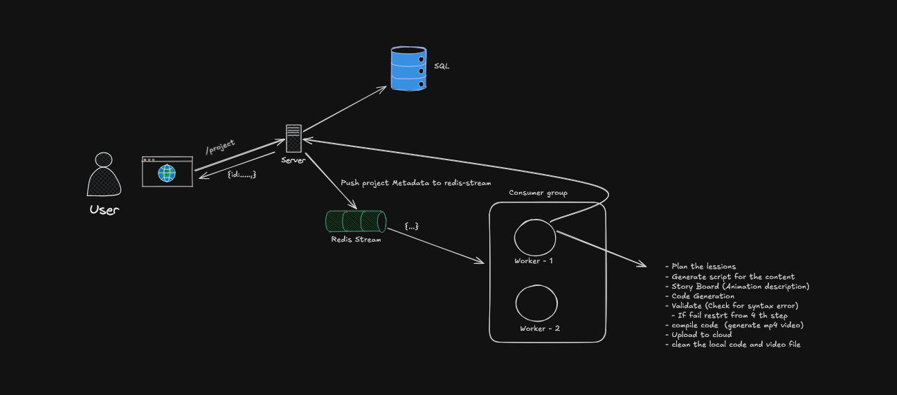
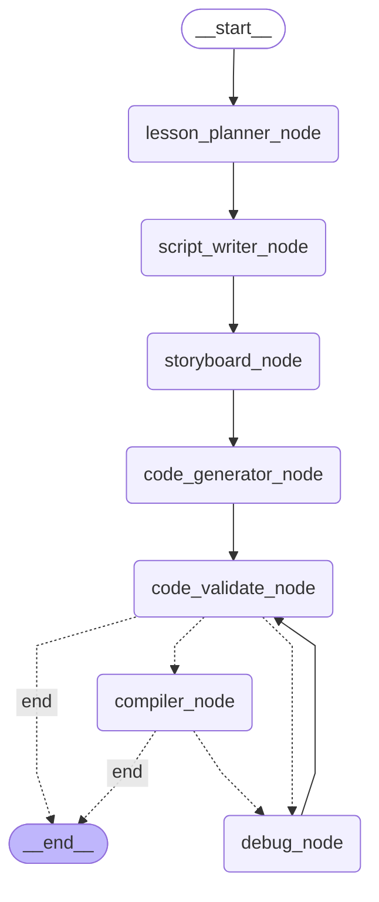

# AnimAI

**AnimAI** is a highly scalable, event-driven platform designed to generate high-quality Manim animations from single-shot text prompts. Built with a distributed microservices architecture, AnimAI leverages a multi-agent system to autonomously plan, generate, validate, and compile complex mathematical and programmatic animations.

## System Architecture

The platform is structured into three decoupled services, utilizing a robust event-driven architecture powered by **Redis Streams** (Producer-Consumer pattern) to handle compute-heavy asynchronous tasks.

### 1. Client (`client`)
A responsive frontend application built with **React**. It serves as the primary interface for users to submit animation prompts and view the rendered video artifacts.

### 2. API Server (`api`)
The backend gateway. It handles incoming HTTP requests from the client, manages state, and acts as the **Producer** in our event-driven system. It enqueues video generation tasks into Redis Streams, bridging the synchronous client with the asynchronous generation pipeline.

### 3. Worker Engine (`worker`)
The core asynchronous video generation service. Acting as the **Consumer**, it pulls tasks from Redis Streams. The worker implements a state-of-the-art **LangGraph** workflow orchestrated by a multi-agent system.

#### Multi-Agent Workflow (LangGraph Nodes)
To ensure high fidelity and reliable code generation, the worker's execution is divided into specialized nodes, each with a distinct responsibility:

- **Plan Node:** Ingests the prompt and constructs a structured storyboard and logical execution plan.
- **Generate Node:** Translates the storyboard into functional Manim Python code.
- **Validate Node:** Statically analyzes and reviews the generated code for syntax errors, logical flaws, and Manim-specific constraints before execution.
- **Compile Node:** Sandboxes and executes the validated Manim code to render the final `.mp4` video artifact.

## Key Technical Highlights
* **Horizontal Scalability:** The Redis Stream producer-consumer pattern allows the `worker` service to scale horizontally. As demand increases, additional worker nodes can be deployed to process the queue concurrently.
* **Fault Tolerance & Resilience:** If a worker fails during the heavy compilation step, tasks remain in the Redis stream (unacknowledged) and can be picked up by another worker, preventing data loss.
* **Modular AI Pipeline:** Breaking down the LLM responsibilities into a LangGraph multi-agent flow (Plan -> Generate -> Validate -> Compile) significantly reduces hallucination rates and improves the success rate of complex Manim rendering compared to zero-shot generation.
